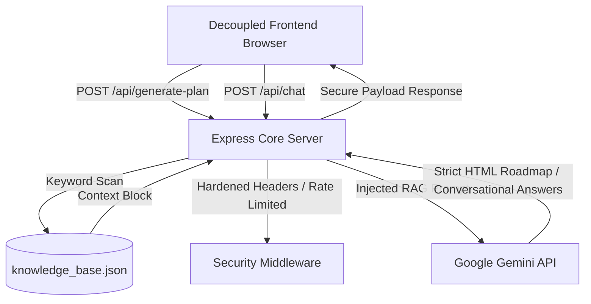

# CyberShield AI — Cybersecurity Academy & RAG Matrix
**Brand System:** S.S.Hemanth Kumar (Security Researcher)

An enterprise-ready, RAG-driven cybersecurity syllabus planner and mentor terminal. Designed with a luxury cyberpunk, glassmorphic layout, canvas animations, and decoupled backend APIs powered by Google Gemini and a local JSON-based knowledge base.

---

## Architecture Overview



---

## Project Structure

```
cybershield-ai/
├── backend/
│   ├── data/
│   │   └── knowledge_base.json     # Structured cybersecurity corpus (RAG)
│   ├── middleware/
│   │   └── security.js             # Helmet, Express Rate Limiting, Schema Validations
│   ├── server.js                   # Node Express core, routing & RAG matcher engine
│   ├── package.json                # Dependencies & start scripts
│   └── .env.example                # Template configuration settings
├── frontend/
│   ├── index.html                  # Main layout structure (sanitized HTML5)
│   ├── style.css                   # Cyberpunk glassmorphic stylesheet
│   └── script.js                   # Client animations and fetch execution logic
└── README.md                       # Documentation and verification guide
```

---

## Installation & Configuration

### Prerequisites
*   Node.js (v18+ recommended)
*   NPM (v9+)
*   Google Gemini API Key (obtained from [Google AI Studio](https://aistudio.google.com/))

### Step 1: Install Dependencies
Navigate to the `backend` folder and install NPM packages:
```bash
cd backend
npm install
```

### Step 2: Configure Environment settings
Copy the environment template and insert your Gemini API Key:
```bash
cp .env.example .env
```
Open the `.env` file and set:
```env
PORT=3000
GEMINI_API_KEY=your_actual_gemini_api_key_here
```

### Step 3: Start Server
Run the local express server:
```bash
npm start
```
The server will bind to `http://localhost:3000` and host both the client presentational layer and API gateways.

---

## Verification Guide

### 1. API Security Hardening (Rate Limiting)
Make concurrent calls to test the rate-limiting capabilities:
*   Expected Behavior: If an IP exceeds 60 requests within a 15-minute window, the server returns `HTTP 429 Too Many Requests` with a JSON warning object.

### 2. Inbound Data Schema Validation
Send a POST request with missing fields (e.g. missing `struggle` or invalid `hours` value) to `/api/generate-plan`:
*   Expected Behavior: Server returns `HTTP 400 Bad Request` with exact descriptions of the validation failures.

### 3. RAG Retrieval Verification
Ask the chat console about: `"How to write an nmap scan for vulnerability checks"`:
*   Expected Behavior: The server tokenizes the input, maps it to `"Nmap"` entries in `knowledge_base.json`, extracts `-sS -sV -p- --script vuln` specifications, and feeds it as active context to the Gemini model. The chatbot responds with concise instructions incorporating these parameters inside `<code>` tags.
